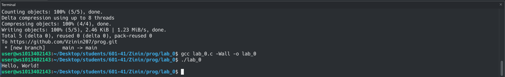
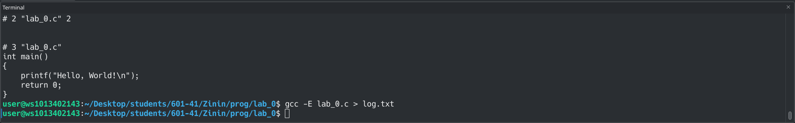
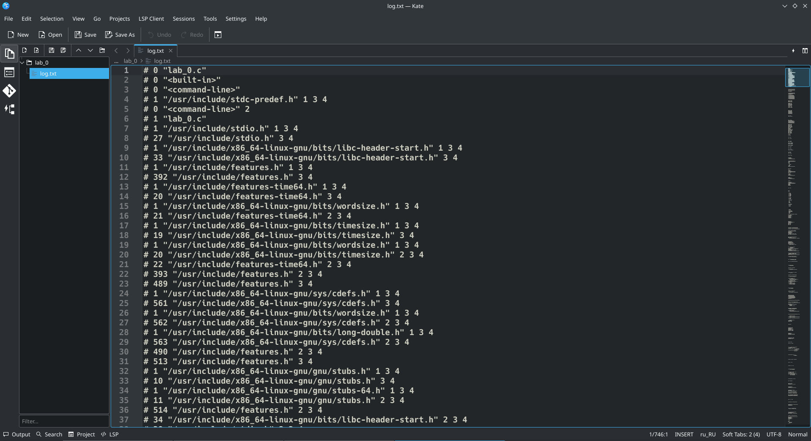
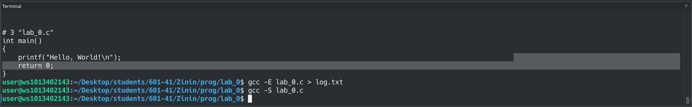
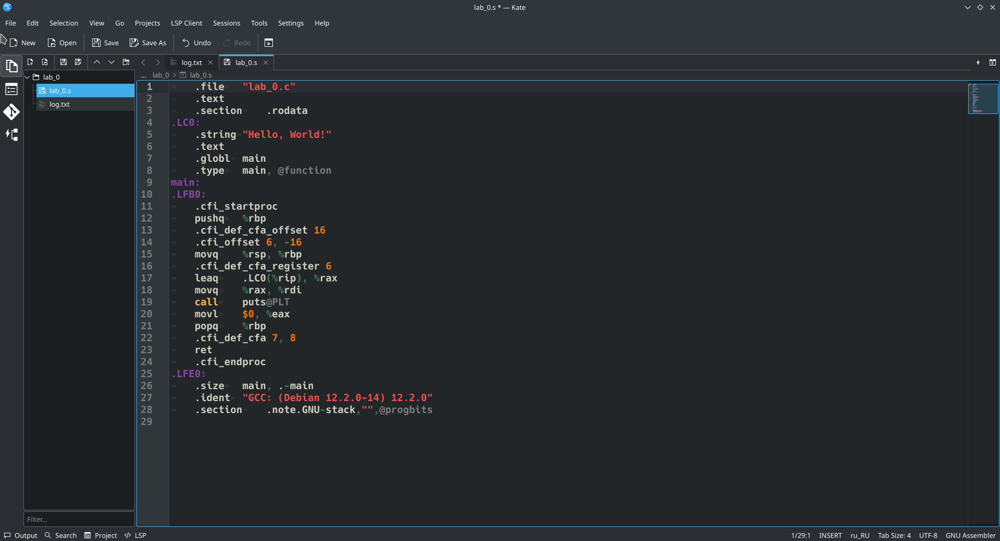
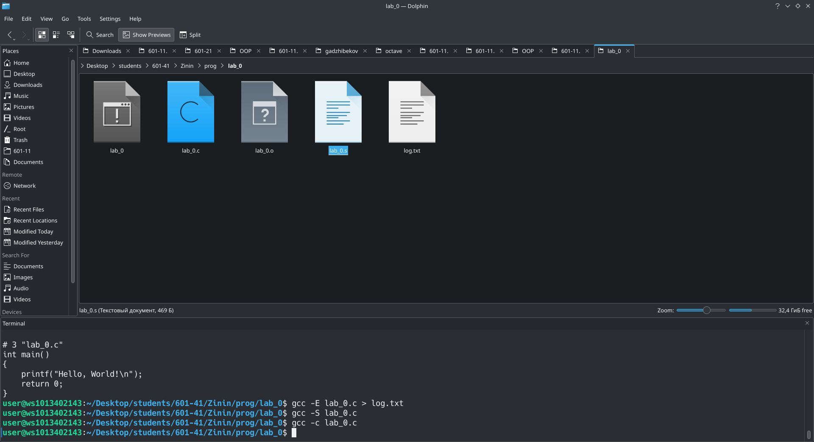

 # Отчет
 ## Задание
1. Создайь репозиторий для дисциплины на GitHub.
1. Склонировать его себе на ПК.
1. Написать свою первую программу.
1. Скомпилировать и запустить её.
1. Получить по отдельности результаты каждого этапа компиляции.
1. Написать отчёт в README.md.
1. Сделать коммит и пуш.
1. Добавить для себя в отчёт шпаргалку по работе с git
## Моя первая программа
 ```c
 #include <stdio.h>

int main()
{
    printf("Hello, World!\n");
    return 0;
}
```
## Проверка программы
Проверка программы на ошибки и создание файла lab_0

## Компиляция и получение по отдельности результатов каждого этапа компиляции 




## Итог работы

## Консольные команды
- touch lab_0.c
- gcc lab_0.c -Wall -o lab_0
- ./lab_0
- git add -A
- git status
- git commit -m "add 2 files"
- git push
- gcc -E lab_0.c
- gcc -E lab_0.c > log.txt
- gcc -S lab_0.c
- gcc -c lab_0.c
## Ссылки на используемые материалы
- [справка по markdonw](https://doka.guide/tools/markdown/)
- [Пример отчета](https://github.com/still-coding/report_demo/blob/main/README.md)
