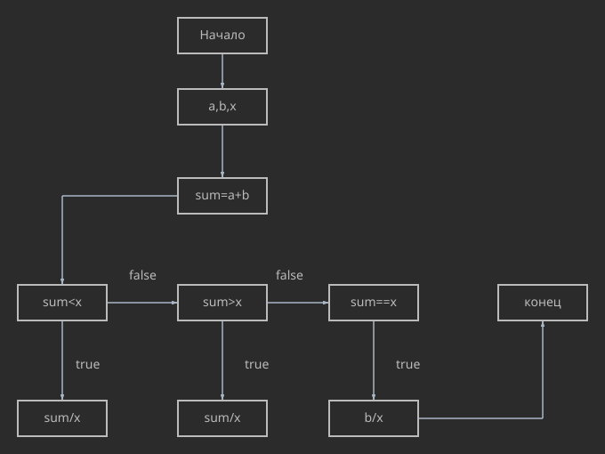

# Отчет
## Задание
1. Разобрать код программы из примера.
1. Составьте блок-схему алгоритма для моего варианта.
1. Написать программу, решающую задачу по моему варианту.
1. Оформить отчёт в README.md.
### Задание моего варианта
Вывести частное суммы параметров a, b и параметра x, если сумма меньше x, и обратное частное, если сумма больше. В случае равенства вывести частное b и x. Точность – 3 знака после запятой.
## Блок-схема алгоритма моего варианта

### Мой код
```c
#include <stdio.h>
int main()
{
    float a,b,x,sum,h;
    printf("Введите число a ");
    scanf("%f",&a);
    printf("Введите число b ");
    scanf("%f",&b);
    printf("Введите число x ");
    scanf("%f",&x);
    sum=a+b;
    if (sum<x)
    {
        h=sum/x;
        printf("частное суммы параметров a, b и параметра x %.3f\n",h);
        return 0;
    }
    if (sum>x)
    {
        h=sum/x;
        printf("частное суммы параметров a, b и параметра x %.3f\n",h);
        return 0;
    }
    if (sum==x);
    {
        h=b/x;
        printf("частное параметра b и параметра x %.3f\n",h);
        return 0;
    }
            
}
```
